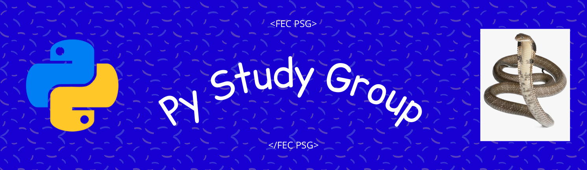

# FEC_PSG

Bienvenidos al grupo de estudio de python .

## Grupo de estudio con Python 🐍

En este grupo de estudio con Python, vamos a introducirnos
en la programacion desde lo mas basico del lenguaje hasta
lo mas complejo. Veremos la teoria y practica para aprender
juntos .

## ¿Cómo nos organizamos? 👍
La idea principal es que podamos aprender entre todos este lindo lenguaje!

La **metodología** que usamos es la siguiente:
- 📢 Estaremos utilizando como medio de comunicación el canal del grupo de estudio en FrontendCafé [FEC]:

[FEC]: https://discord.gg/frontendcafe

## Guia basica 🐍

En este mismo README les dejare un una guia y requisitos para 
la primera reunion, deben tener una cuenta en Github para seguir
los siguientes pasos .

Primero crearemos un entorno virtual, 
en el canal vamos a seguir estas instrucciones juntos .

Si no estas en la comunidad podes encontrarnos aqui [FEC] .

[FEC]: https://discord.gg/frontendcafe

Antes de avanzar seguiremos estos pasos :

En tu powershell ejecutas la siguiente linea .

* Get-ExecutionPolicy

Si la respuesta es restricted ejecutas lo siguiente .

* Set-ExecutionPolicy unrestricted

Una vez completo esto crearemos nuestro entorno virtual .

Seleccionamos una carpeta ej: Python_group .

Ahora veamos si tenemos python y que version .

* python --version

    esta seria la respues 
    
    >Python 3.9.9

    si no lo tienes lo instalamos desde [Python]

    [Python]: https://www.python.org/ftp/python/3.9.10/python-3.9.10-embed-amd64.zip

Ahora creamos nuestro entorno .

* Instalamos la libreria .
    > pip install virtualenv

* En este paso creamos nuestro entorno .
    
    > vitualenv env

* Y lo activamos .
    > env\Scripts\activate

* Ahora ya tenemos nuestro entorno virtual se deberia ver asi 
    
    > (env) PS C:\Python_group>

En este sitio vamos a clonar nuestro repositorio .

* Clonamos este repo .

    > git clone 